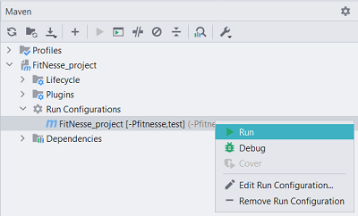
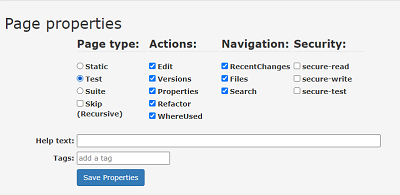
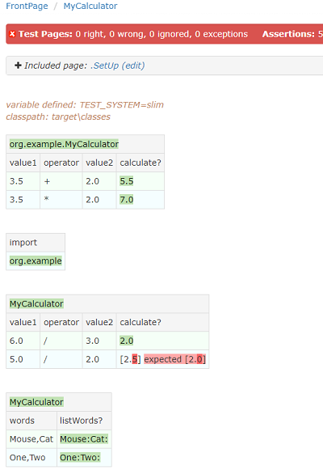

 Acceptance testing with FitNesse (Examples)
==========================================================
### Testing examples described in beginner FitNesse tutorial [https://www.softwaretestingclass.com/introduction-to-fitnesse-testing-tool-tutorial-for-beginners/](https://www.softwaretestingclass.com/introduction-to-fitnesse-testing-tool-tutorial-for-beginners/) as part of Maven project created using InteliJ IDE and Java

## What is FitNesse

Lightweight opensource software for acceptance testing. Acceptance testing is black-box functional testing that ensures that system under test meets stakeholders' requirements. The main goal of performing this type of tests is not to identify errors in the code but to verify that given a certain input the result matches what is expected.
It is also a tool for collaboration, as it is regularly used by QA experts, developers, clients, support teams, team managers and so on. FitNesse is a wiki webserver that requires no configuration and provides readable test results. Users basically create web pages where tables are used to provide input data and perform tests in order to compare actual results with expected.

- **provides early feedback**
- **tests can be run anytime by anyone as they are hosted on a server**
- **tests are deterministic (they either pass and are green or fail and are red), the more tests pass the closer the system is meeting stakeholders' requirements**
- **FitNesse increases business value of a product**

## Running FitNesse server

- In order to run FitNesse server the jar file ([http://fitnesse.org/FitNesseDownload](http://fitnesse.org/FitNesseDownload)) can be downloaded to our system after which the following command can be used `java –jar fitnesse-standalone.jar –p 80`. We can then access the server at [http://localhost:80/](http://localhost:80/).
- FitNesse wiki frontend can also be used as a part of a project in InteliJ by adding corresponding maven dependencies and properties, create a profile with id value **fitnesse** and add **maven-antrun-plugin** in **pom.xml** file. To easily execute the configuration added with the plugin while using corresponding profile, maven run configuration is added to the project by using `-Pfitnesse test` command. Process is explained in detail here [https://www.youtube.com/watch?v=u-zbm5xVTvM](https://www.youtube.com/watch?v=u-zbm5xVTvM). After using the added run configuration (see image below), FitNesse Front Page can be accessed at [http://localhost:8000/FrontPage](http://localhost:8000/FrontPage).
---

---
- **Note** : Java classes need to be compiled to be used as FitNesse test fixtures. Path to location of compiled java classes needs to be defined on page before running tests (example: `!path target\classes`) . A page can then be run as a test by choosing the **Test** option in the **Properties** section that can be opened by using the **Tools** menu on the wiki page.
---

---
## **MyCalculator** demo page

- Can be accessed through link on Frontpage. Used to demonstrate how to perform test using Java fixture. The image below show the page after execution of tests. Using the methods defined in Java fixture class, input data is provided and actual output is compared to expected. Import table is also used to include the necessary packages for the second decision table. Passed tests are marked with green color and in the second decision table there is an example on a failed test due to actual output **(2.0)** not matching expected **(2.5)**.
---

---
## **ScientificCalculator** page

- **CalculatorSystems** page
  1. Performs acceptance tests for addition, subtraction, multiplication and division operations performed by using two operators. Methods and operators are defined in java class **org.example.CalculatorTest**.
  2. Decision table on page **TrigonometricFunction** is used to perform acceptance tests for trigonometric function sine, cosine and tangent for four different values as operands. Methods are defined in java class **org.example.ScientificCalculatorTest** that also uses **org.example.TrigonometricFunction** class.
  3. Decision table on page **LogarithmicFunction** is used to perform acceptance tests for logarithmic function logarithm10 and logarithm for two different values as operands. Methods are defined in java class **org.example.ScientificCalculatorTest** that also uses **org.example.LogarithmicFunction** class.
  - **Note** : Java class **org.example.Calculate** is used to create objects from each class mentioned above and main() class method is called to compile classes. In this classes tests calls are made to methods in order to define expected results used in decision tables.
## **DynamicDecisionTable** page
Example that demonstrates how to use dynamic decision table by using symbols as values in decision table. Fixture class **org.example.DynamicDecisionTable** is used. System under tests performs simple conversion of cents and euro values in coins to total value in euros.
## Query tables
Pages **Query Table**, **Subset Query Table** and **Ordered Query Table** use the same class as fixture - **org.example.QueryTable** to demonstrate usage of different types of query tables. In the java class data for each row in the corresponding query table is defined.
## Script tables
**Script Table** page uses java class **org.example.ScriptTable** to demonstrate the usage of script tables when performing acceptance tests. In this example, the system under test simulates a login operation. Username value used is: **Apply** and password value is **softtestclass**. Data for received message after login attempt, total number of attempts is also provided for testing. Value for login message is stored using symbol.
## Using cheat codes on a FitNesse page
**CheatsheetDemo** page demonstrates usage of formatting cheat that are present in the FitNesse tool. Examples include text formatting, heading formatting, line and block formatting.
## **Scenario Tables**
Used as a way to express a sequence of steps required as part of an automated acceptance test. A Scenario table takes a number of parameters, specified as part of its name, and then expresses one or more steps, any of which may use any of the parameters provided. **ScenarioTable** page demonstrates the example explained in detail at [https://schuchert.github.io/wikispaces/pages/FitNesse.Tutorials.ScenarioTables.OriginalArticle](https://schuchert.github.io/wikispaces/pages/FitNesse.Tutorials.ScenarioTables.OriginalArticle).

